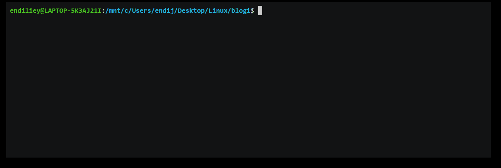

<h1 align="center">Webpack-NiceLog</h1>



## Install

```
$ npm install webpack-nicelog --save-dev
```


## Usage

```js
// webpack.config.js
const WebpackNiceLog = require('webpack-nicelog');

module.exports = {
  // ...
  plugins: [
    new WebpackNiceLog()
  ]
}
```


## API

### WebpackNiceLog(options)

#### options.onDone (optional)

Type: `Function`

Run a custom function after bundle has been successfully compiled.

## License

MIT © [Endilie Yacop Sucipto](https://endiliey.com)
